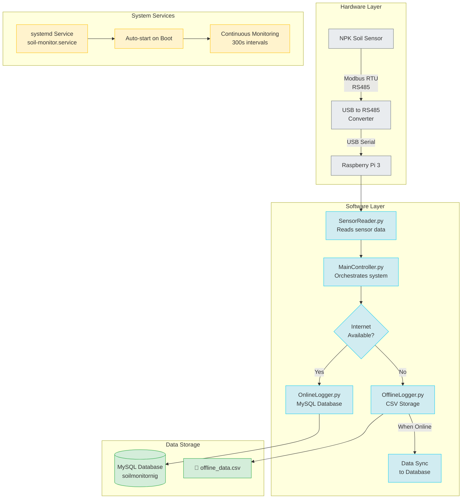
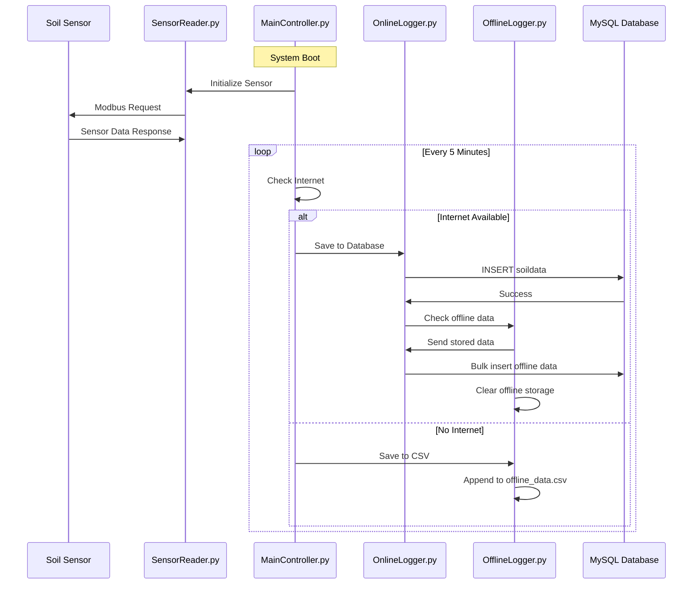

# System Architecture

## Overall System Flow

```mermaid
graph TB
    subgraph Hardware Layer
        A[NPK Soil Sensor] -->|Modbus RTU<br/>RS485| B[USB to RS485<br/>Converter]
        B -->|USB Serial| C[Raspberry Pi 3]
    end

    subgraph Software Layer
        C --> D[SensorReader.py<br/>Reads sensor data]
        D --> E[MainController.py<br/>Orchestrates system]
        
        E --> F{Internet<br/>Available?}
        F -->|Yes| G[OnlineLogger.py<br/>MySQL Database]
        F -->|No| H[OfflineLogger.py<br/>CSV Storage]
        
        H -->|When Online| I[Data Sync<br/>to Database]
    end

    subgraph Data Storage
        G --> J[(MySQL Database<br/>soilmonitornig)]
        H --> K[📁 offline_data.csv]
    end

    subgraph System Services
        L[systemd Service<br/>soil-monitor.service] --> M[Auto-start on Boot]
        M --> N[Continuous Monitoring<br/>300s intervals]
    end

    classDef hardware fill:#e9ecef,stroke:#6c757d
    classDef software fill:#d1ecf1,stroke:#0dcaf0
    classDef storage fill:#d4edda,stroke:#28a745
    classDef service fill:#fff3cd,stroke:#ffc107
    
    class A,B,C hardware
    class D,E,F,G,H,I software
    class J,K storage
    class L,M,N service
```

## Component Interactions

```mermaid
sequenceDiagram
    participant S as Soil Sensor
    participant SR as SensorReader.py
    participant MC as MainController.py
    participant OL as OnlineLogger.py
    participant OFL as OfflineLogger.py
    participant DB as MySQL Database

    Note over MC: System Boot
    MC->>SR: Initialize Sensor
    SR->>S: Modbus Request
    S->>SR: Sensor Data Response
    
    loop Every 5 Minutes
        MC->>MC: Check Internet
        alt Internet Available
            MC->>OL: Save to Database
            OL->>DB: INSERT soildata
            DB->>OL: Success
            OL->>OFL: Check offline data
            OFL->>OL: Send stored data
            OL->>DB: Bulk insert offline data
            OFL->>OFL: Clear offline storage
        else No Internet
            MC->>OFL: Save to CSV
            OFL->>OFL: Append to offline_data.csv
        end
    end
```
