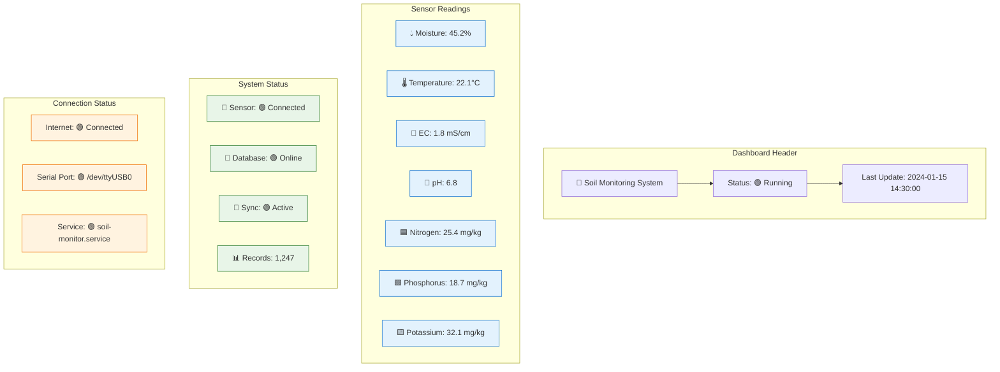
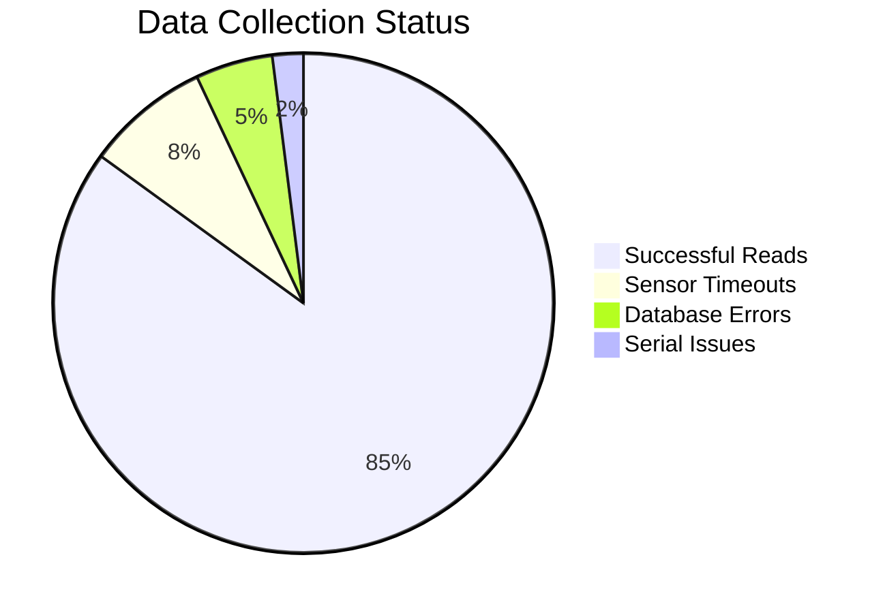
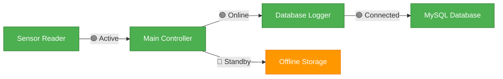

# System Dashboard Overview

## Real-time Monitoring Interface

```mermaid
graph TB
    subgraph Dashboard Header
        A[🌱 Soil Monitoring System] --> B[Status: 🟢 Running]
        B --> C[Last Update: 2024-01-15 14:30:00]
    end

    subgraph Sensor Readings
        D[💧 Moisture: 45.2%]
        E[🌡️ Temperature: 22.1°C]
        F[🔋 EC: 1.8 mS/cm]
        G[🧪 pH: 6.8]
        H[🟦 Nitrogen: 25.4 mg/kg]
        I[🟩 Phosphorus: 18.7 mg/kg]
        J[🟨 Potassium: 32.1 mg/kg]
    end

    subgraph System Status
        K[📡 Sensor: 🟢 Connected]
        L[💾 Database: 🟢 Online]
        M[🔄 Sync: 🟢 Active]
        N[📊 Records: 1,247]
    end

    subgraph Connection Status
        O[Internet: 🟢 Connected]
        P[Serial Port: 🟢 /dev/ttyUSB0]
        Q[Service: 🟢 soil-monitor.service]
    end

    classDef reading fill:#e3f2fd,stroke:#1976d2
    classDef status fill:#e8f5e8,stroke:#2e7d32
    classDef connection fill:#fff3e0,stroke:#ef6c00
    
    class D,E,F,G,H,I,J reading
    class K,L,M,N status
    class O,P,Q connection
```

## Data Flow Visualization

```mermaid
pie title Data Collection Status
    "Successful Reads" : 85
    "Sensor Timeouts" : 8
    "Database Errors" : 5
    "Serial Issues" : 2
```

## Service Status Panel

```mermaid
graph LR
    A[Sensor Reader] -->|🟢 Active| B[Main Controller]
    B -->|🟢 Online| C[Database Logger]
    B -->|🔴 Standby| D[Offline Storage]
    C -->|🟢 Connected| E[MySQL Database]
    
    classDef active fill:#4caf50,stroke:#2e7d32,color:white
    classDef standby fill:#ff9800,stroke:#ef6c00,color:white
    
    class A,B,C,E active
    class D standby
```
