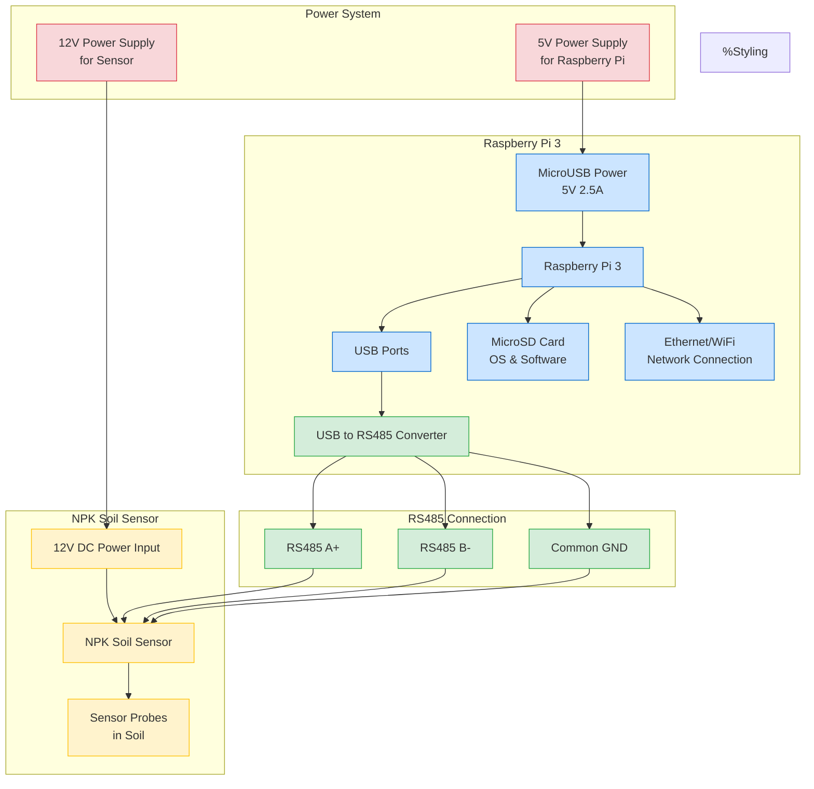
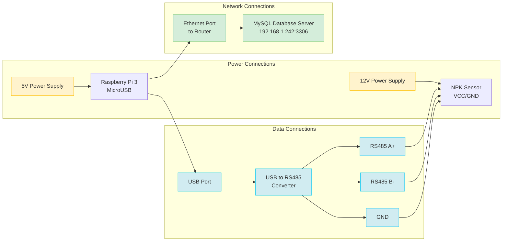
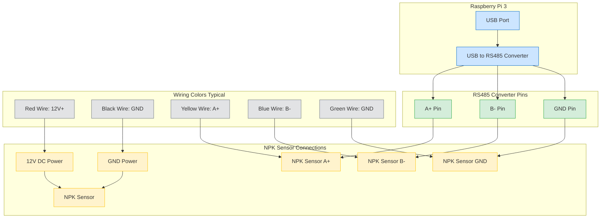

#Hardare Setup

# System Architecture

## Wiring Setup

```mermaid
graph TB
    subgraph Raspberry Pi 3
        A[MicroUSB Power<br/>5V 2.5A] --> B[Raspberry Pi 3]
        B --> C[USB Ports]
        C --> D[USB to RS485 Converter]
        B --> E[MicroSD Card<br/>OS & Software]
        B --> F[Ethernet/WiFi<br/>Network Connection]
    end

    subgraph RS485 Connection
        D --> G[RS485 A+]
        D --> H[RS485 B-]
        D --> I[Common GND]
    end

    subgraph NPK Soil Sensor
        J[12V DC Power Input] --> K[NPK Soil Sensor]
        G --> K
        H --> K
        I --> K
        K --> L[Sensor Probes<br/>in Soil]
    end

    subgraph Power System
        M[5V Power Supply<br/>for Raspberry Pi] --> A
        N[12V Power Supply<br/>for Sensor] --> J
    end

    %Styling
    classDef rpi fill:#cce5ff,stroke:#0066cc
    classDef converter fill:#d4edda,stroke:#28a745
    classDef sensor fill:#fff3cd,stroke:#ffc107
    classDef power fill:#f8d7da,stroke:#dc3545
    classDef connection fill:#e2e3e5,stroke:#6c757d
    
    class A,B,C,E,F rpi
    class D,G,H,I converter
    class J,K,L sensor
    class M,N power
```

## Detailed Connection

```mermaid
graph LR
    subgraph Power Connections
        A[5V Power Supply] --> B[Raspberry Pi 3<br/>MicroUSB]
        C[12V Power Supply] --> D[NPK Sensor<br/>VCC/GND]
    end

    subgraph Data Connections
        B --> E[USB Port]
        E --> F[USB to RS485<br/>Converter]
        F --> G[RS485 A+]
        F --> H[RS485 B-]
        F --> I[GND]
        G --> D
        H --> D
        I --> D
    end

    subgraph Network Connections
        B --> J[Ethernet Port<br/>to Router]
        J --> K[MySQL Database Server<br/>192.168.1.242:3306]
    end

    classDef power fill:#fff3cd,stroke:#ffc107
    classDef data fill:#d1ecf1,stroke:#0dcaf0
    classDef network fill:#d4edda,stroke:#28a745
    
    class A,C power
    class E,F,G,H,I data
    class J,K network

```

## Pin-to-Pin Wiring

```mermaid
flowchart TD
    subgraph Raspberry Pi 3
        A[USB Port] --> B[USB to RS485 Converter]
    end

    subgraph RS485 Converter Pins
        B --> C[A+ Pin]
        B --> D[B- Pin]
        B --> E[GND Pin]
    end

    subgraph NPK Sensor Connections
        F[12V DC Power] --> G[NPK Sensor]
        H[GND Power] --> G
        C --> I[NPK Sensor A+]
        D --> J[NPK Sensor B-]
        E --> K[NPK Sensor GND]
    end

    subgraph Wiring Colors Typical
        L[Red Wire: 12V+] --> F
        M[Black Wire: GND] --> H
        N[Yellow Wire: A+] --> I
        O[Blue Wire: B-] --> J
        P[Green Wire: GND] --> K
    end

    classDef rpi fill:#cce5ff,stroke:#0066cc
    classDef converter fill:#d4edda,stroke:#28a745
    classDef sensor fill:#fff3cd,stroke:#ffc107
    classDef wire fill:#e2e3e5,stroke:#6c757d
    
    class A,B rpi
    class C,D,E converter
    class F,G,H,I,J,K sensor
    class L,M,N,O,P wire


```

